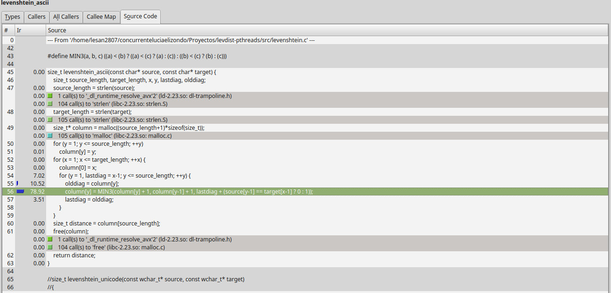
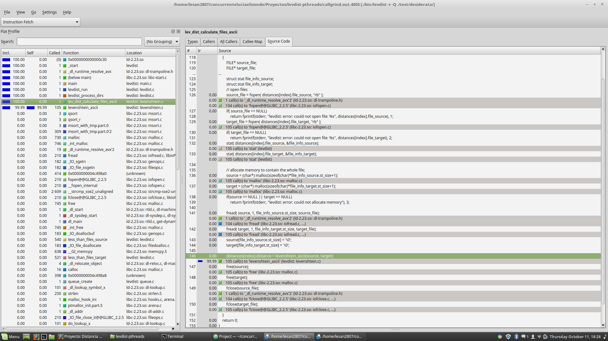
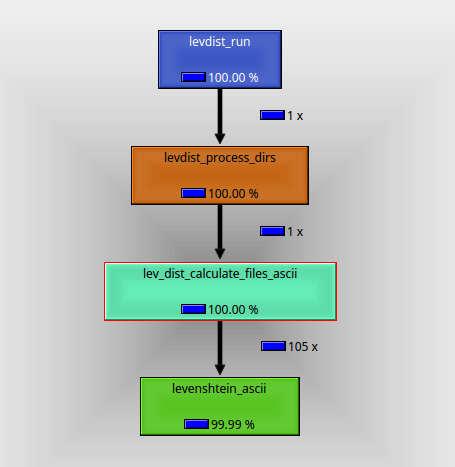

# Profiling

## CPU

Using the tool callgrind, the most CPU consuming function is the one that calculates Levenshtein's distance.
We can see it with the source code and with the call graph shown below.

  

## Time

Using the tool gprof we can determine which function consumes more time. With this we can tell that the function that calculates Levenshtein's distances takes the most time.
Running the levdist program with all the test cases (ASCII) takes about 1716.11 seconds, with gprof, only calculating the Levenshtein's distance takes 1706.24 seconds. This shows that the times are very similar and that the function for Levenshtein's distance consumes a lot of time to calculate distances.

## Cache

Using the tool cachegrind, we can determine which function uses the most of cache memory and its misses. With the visual aid of kcachegrind we see that calculating the Levenshtein's distance consumes a lot of cache, and makes a lot of misses in the cache.

Cache miss is a state where the data requested for processing by a component or application is not found in the cache memory. It causes execution delays by requiring the program or application to fetch the data from other cache levels or the main memory.
(https://www.techopedia.com/definition/6308/cache-miss).

With the levdist program, in order to calculate the distance of a cell, you need to have calculated previous information and use the minimum of them all. This could potentially make the program fetch the data from other cache levels or the main memory thus creating cache misses.
